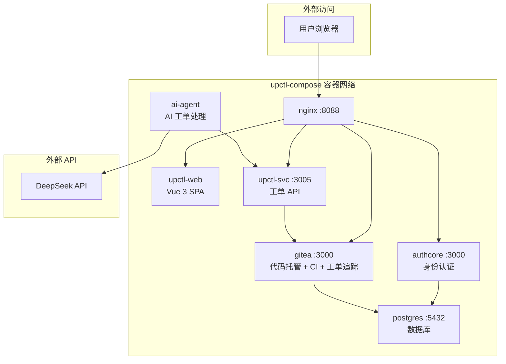
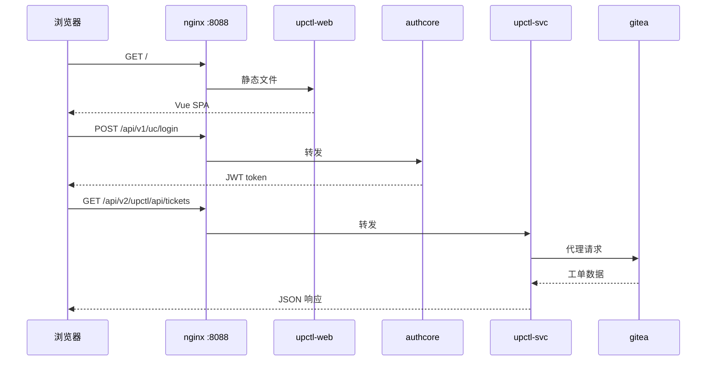
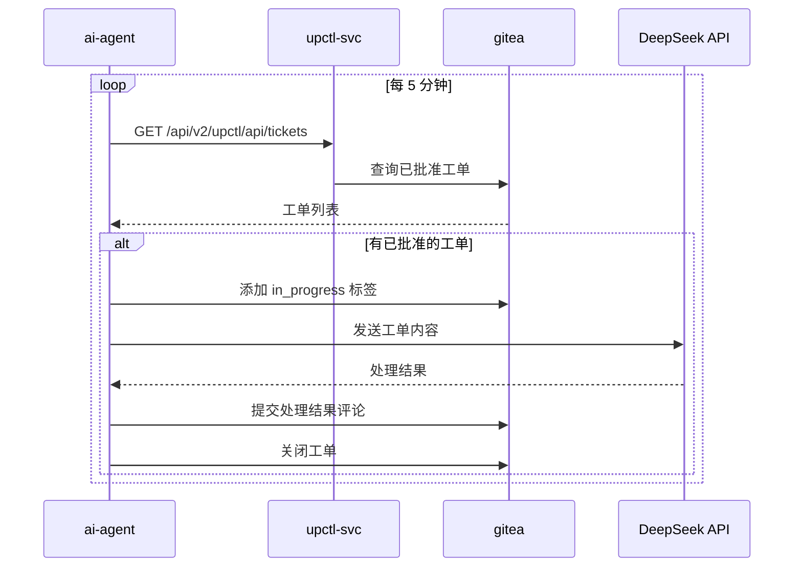

# upctl-compose Architecture

## System Overview

## Service Table

| Service | Description | Internal Port |
|---------|-------------|---------------|
| **nginx** | Reverse proxy (static files + API routing) | 80 → :8088 |
| **authcore** | AuthCore identity & auth service | 3000 |
| **upctl-svc** | Ticket management API (Gitea proxy + attachments) | 3005 |
| **upctl-web** | Vue 3 ticket management frontend (served by nginx) | — |
| **authcoreadmin** | Vue 3 AuthCore admin frontend (teacher management) | 80 → :8089 |
| **ai-agent** | AI agent: polls Gitea, processes tickets via DeepSeek API | — |
| **gitea** | Code hosting, CI/CD runner, and issue tracker | 3000/3001 |
| **postgres** | Database for all services | 5432 |

## Request Flow

## AI Agent Flow

## API Routing (nginx)

| Location | Upstream |
|----------|----------|
| `/` | Static files (upctl-web dist) |
| `/admin/` | `authcoreadmin:80` (proxied) |
| `/api/v1/uc/` | `authcore:3000` |
| `/api/v2/upctl/api/` | `upctl-svc:3005` |
| `/gitea/` | `gitea:3000` |

## Services Detail

### upctl-web

Vue 3 + Vite SPA. Built with empty `UC_SERVER`/`TS_SERVER` so all API calls
go through nginx (same-origin proxy). Login supports username/password via
AuthCore's global password feature.

### upctl-svc

Rust Axum service providing:
- Gitea API proxy for ticket CRUD operations (list, create, update, close, comment)
- Attachment upload and serving (local storage in `uploads/` volume)
- JWT authentication via AuthCore

### ai-agent

Python-based AI worker that:
- Polls upctl-svc for approved Gitea tickets every 5 minutes
- Processes tickets using DeepSeek V4 API (OpenAI-compatible SDK)
- Adds comments and closes tickets automatically
- Runs in a tmux session for interactive access

Requires `DEEPSEEK_API_KEY` environment variable to be set.

## Data Persistence

- PostgreSQL data: `pgdata` volume
- Gitea data: `gitea` volume
- Uploaded attachments: `uploads` volume
- AI agent workspace: `agent-workspace` volume
