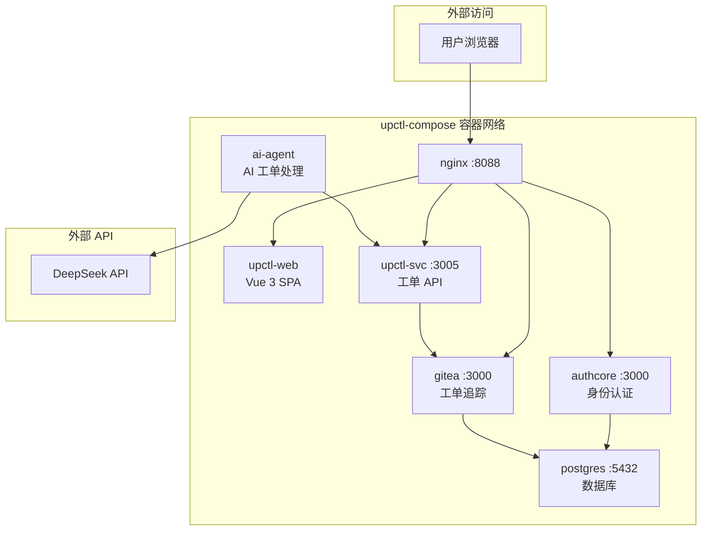
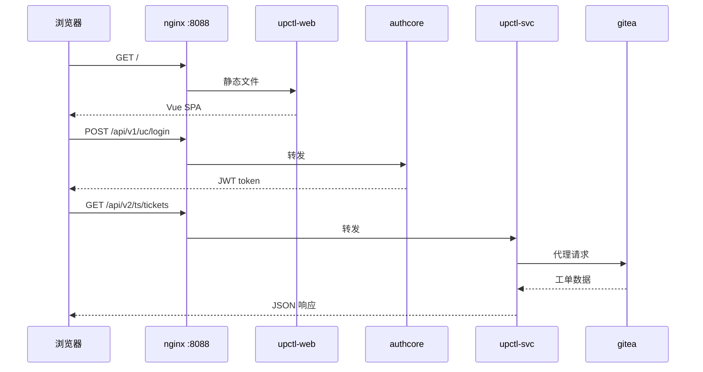
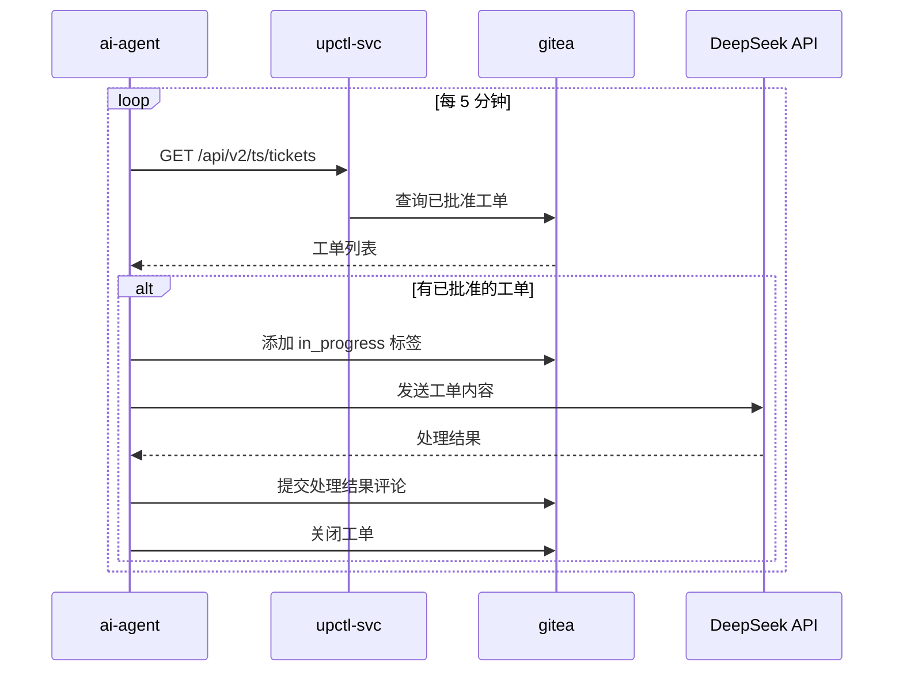

# upctl-compose

Docker Compose project for `upctl` — ticket management system.

## Services

| Service | Description | Internal Port |
|---------|-------------|---------------|
| **nginx** | Reverse proxy (static files + API routing) | 80 → :8088 |
| **authcore** | AuthCore identity & auth service | 3000 |
| **upctl-svc** | Ticket management API (Gitea proxy + attachments) | 3005 |
| **upctl-web** | Vue 3 ticket management frontend (served by nginx) | — |
| **ai-agent** | AI agent: polls Gitea, processes tickets via DeepSeek API | — |
| **gitea** | Issue tracker (self-hosted) | 3000/3001 |
| **postgres** | Database for all services | 5432 |

## Quick Start

```bash
# Start all services
docker compose up -d

# Wait for all services to be healthy, then seed test data
bash scripts/seed.sh
```

## Architecture



### Request Flow



### AI Agent Flow



### API Routing (nginx)

| Location | Upstream |
|----------|----------|
| `/` | Static files (upctl-web dist) |
| `/api/v1/uc/` | `authcore:3000` |
| `/api/v2/ts/` | `upctl-svc:3005` |
| `/gitea/` | `gitea:3000` |

## Services Detail

### upctl-web

Vue 3 + Vite SPA. Built with empty `UC_SERVER`/`TS_SERVER` so all API calls
go through nginx (same-origin proxy). Login supports username/password via
AuthCore's global password feature.

### upctl-svc

Rust Axum service providing:
- Gitea API proxy for ticket CRUD operations (list, create, update, close, comment)
- Attachment upload and serving (local storage in `uploads/` volume)
- JWT authentication via AuthCore

### ai-agent

Python-based AI worker that:
- Polls upctl-svc for approved Gitea tickets every 5 minutes
- Processes tickets using DeepSeek V4 API (OpenAI-compatible SDK)
- Adds comments and closes tickets automatically
- Runs in a tmux session for interactive access

Requires `DEEPSEEK_API_KEY` environment variable to be set.

## Development

```bash
# Rebuild a specific service after code changes
docker compose build authcore
docker compose up -d authcore

# View logs
docker compose logs -f upctl-svc

# Enter ai-agent tmux session
docker compose exec ai-agent tmux attach -t deepseek-agent
```

## Data Persistence

- PostgreSQL data: `pgdata` volume
- Gitea data: `gitea` volume
- Uploaded attachments: `uploads` volume
- AI agent workspace: `agent-workspace` volume

## CI Pipeline

GitHub Actions 自动运行：
1. **lint** — 验证 docker-compose.yml 格式
2. **build** — 构建所有服务镜像（authcore, upctl-svc, upctl-web, ai-agent）
3. **integration** — 启动全部服务，运行冒烟测试和 E2E 测试

## E2E Testing

端到端测试脚本 `tests/e2e_test.py` 覆盖完整工单生命周期：

1. **Gitea API 连通性** — 通过 upctl-svc 代理列出工单和标签
2. **工单 CRUD** — 创建工单 → 添加 label → 添加评论 → 关闭工单
3. **DeepSeek API 处理** — 调用 AI 模型并验证响应
4. **AI Agent 模块** — 导入 poll_worker 模块并列出已批准工单

CI 中自动运行：

```bash
docker compose cp tests/e2e_test.py ai-agent:/app/e2e_test.py
docker compose exec -T ai-agent python3 /app/e2e_test.py
```

也可以在本地运行：

```bash
# 确保所有服务已启动
docker compose up -d

# 复制测试脚本到 ai-agent 容器并运行
docker compose cp tests/e2e_test.py ai-agent:/app/e2e_test.py
docker compose exec ai-agent python3 /app/e2e_test.py
```
