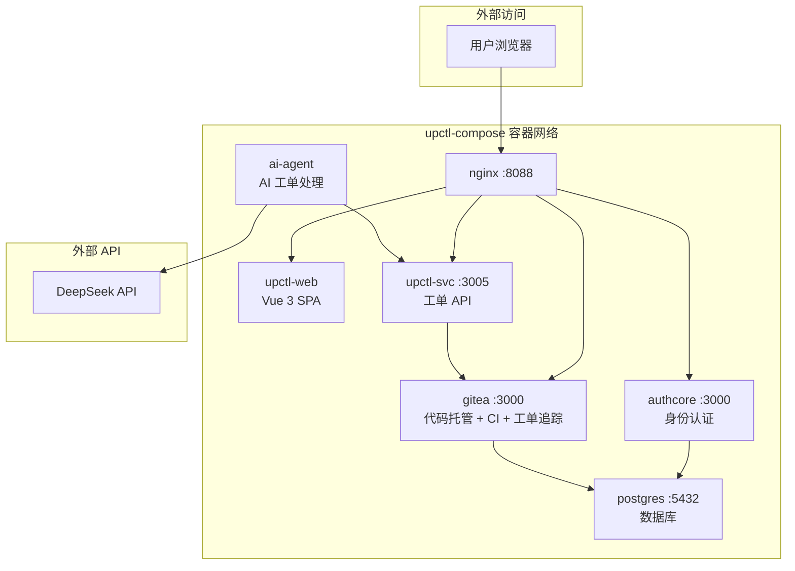
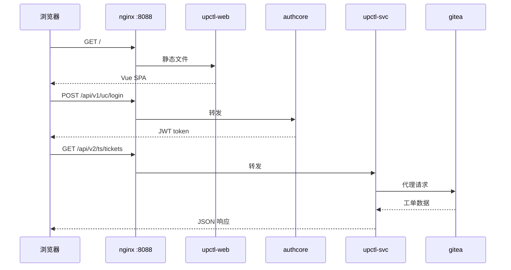
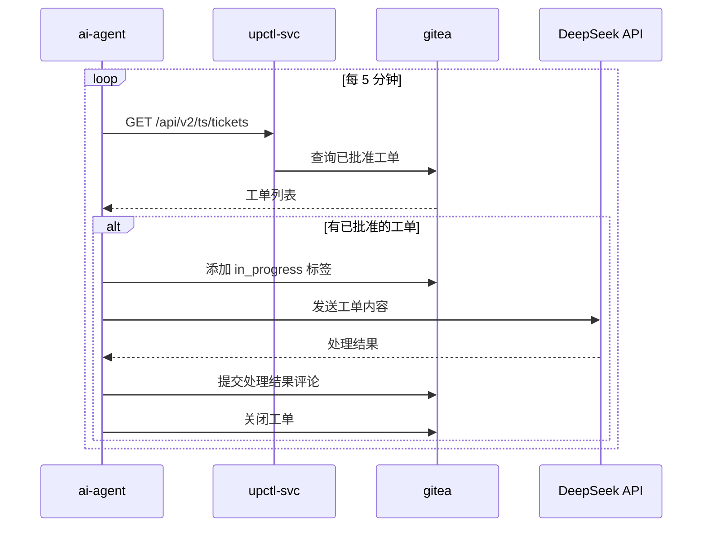

# upctl-compose

Docker Compose project for `upctl` — ticket management system.

## Services

| Service | Description | Internal Port |
|---------|-------------|---------------|
| **nginx** | Reverse proxy (static files + API routing) | 80 → :8088 |
| **authcore** | AuthCore identity & auth service | 3000 |
| **upctl-svc** | Ticket management API (Gitea proxy + attachments) | 3005 |
| **upctl-web** | Vue 3 ticket management frontend (served by nginx) | — |
| **ai-agent** | AI agent: polls Gitea, processes tickets via DeepSeek API | — |
| **gitea** | Code hosting, CI/CD runner, and issue tracker | 3000/3001 |
| **postgres** | Database for all services | 5432 |

## Quick Start

```bash
# 1. Clone and enter the project
git clone https://github.com/alchemy-studio/upctl-compose.git
cd upctl-compose

# 2. (Optional) Set DeepSeek API key for AI agent
echo "DEEPSEEK_API_KEY=sk-your-key-here" > .env

# 3. Start all services in background
docker compose up -d

# 4. Seed Gitea with org, repo, and labels
# Wait ~30s for services to be healthy, then:
docker compose exec ai-agent python3 /app/setup-gitea.py

# 5. Open in browser
open http://localhost:8088
```

## 本地部署运行指南

### 环境要求

| 要求 | 版本 |
|------|------|
| Docker | >= 24.0 |
| Docker Compose | >= 2.24 (含 `docker compose` 插件) |
| Git | 任意现代版本 |

### 首次启动

```bash
# 克隆仓库
git clone https://github.com/alchemy-studio/upctl-compose.git
cd upctl-compose

# 启动依赖服务（数据库和 Gitea）
docker compose up -d postgres gitea

# 等待数据库就绪（约 10 秒）
until docker compose exec postgres pg_isready -U upctl; do sleep 2; done

# 启动全部服务
docker compose up -d

# 查看服务日志确认启动正常
docker compose logs --tail=20 authcore upctl-svc upctl-web
```

### 初始化 Gitea

首次启动需要初始化 Gitea（组织、仓库、标签）：

```bash
# 检测 Gitea 是否就绪
until curl -sf http://localhost:3001/api/v1/version > /dev/null 2>&1; do
  echo "等待 Gitea 就绪..."
  sleep 3
done

# 运行初始化脚本（创建 org weli、仓库 tickets、标签）
docker compose exec ai-agent python3 /app/setup-gitea.py
```

初始化后，访问 `http://localhost:8088` 即可看到工单管理界面。使用 `http://localhost:3001` 访问 Gitea 管理界面（用户 `ai-bot` / 密码 `ai-bot-dev-pass`）。

### 配置 AI 代理（可选）

`ai-agent` 使用 DeepSeek API 自动处理工单。需要在项目根目录创建 `.env` 文件：

```bash
# .env
DEEPSEEK_API_KEY=sk-your-deepseek-api-key
DEEPSEEK_API_BASE=https://api.deepseek.com
DEFAULT_MODEL=deepseek-chat
```

设置后重启 `ai-agent`：

```bash
docker compose up -d ai-agent
```

AI 代理每 5 分钟轮询一次 Gitea，自动处理带 `approved` 标签的工单。

### 验证部署

```bash
# 检查所有服务运行状态
docker compose ps

# 冒烟测试：各服务 API
curl -sf http://localhost:8088/ | head -c 200          # 前端 HTML
curl -sf http://localhost:3005/                         # upctl-svc → "upctl-svc"
curl -sf http://localhost:3000/                         # authcore → "AuthCore"

# Gitea API 连通性
curl -sf http://localhost:3001/api/v1/version

# 运行 E2E 测试
docker compose cp tests/e2e_test.py ai-agent:/app/e2e_test.py
docker compose exec -T ai-agent python3 /app/e2e_test.py
```

### 常见问题

| 问题 | 原因 | 解决 |
|------|------|------|
| `panic: POOL_SIZE must be set` | authcore 缺少环境变量 | 确保 docker-compose.yml 中 `authcore` 有 `POOL_SIZE: "10"` |
| `JWT_KEY not set` | upctl-svc 缺少 JWT_KEY | 确保 docker-compose.yml 中 `upctl-svc` 有 `JWT_KEY` 环境变量 |
| Gitea API 返回 404 | API 路径错误 | 使用 `/api/v1/` 根路径，非 `/gitea/api/v1/` |
| 前端页面白屏 / JS 404 | 前端资源未正确构建 | `docker compose build upctl-web` 重新构建 |
| `ai-agent` 未连接到 DeepSeek | 缺少 API Key | 配置 `DEEPSEEK_API_KEY` 环境变量后重启 |

### 停止与清理

```bash
# 停止所有服务（保留数据卷）
docker compose down

# 完全清理（删除所有数据）
docker compose down -v
```

## Architecture



### Request Flow



### AI Agent Flow



### API Routing (nginx)

| Location | Upstream |
|----------|----------|
| `/` | Static files (upctl-web dist) |
| `/api/v1/uc/` | `authcore:3000` |
| `/api/v2/ts/` | `upctl-svc:3005` |
| `/gitea/` | `gitea:3000` |

## Services Detail

### upctl-web

Vue 3 + Vite SPA. Built with empty `UC_SERVER`/`TS_SERVER` so all API calls
go through nginx (same-origin proxy). Login supports username/password via
AuthCore's global password feature.

### upctl-svc

Rust Axum service providing:
- Gitea API proxy for ticket CRUD operations (list, create, update, close, comment)
- Attachment upload and serving (local storage in `uploads/` volume)
- JWT authentication via AuthCore

### ai-agent

Python-based AI worker that:
- Polls upctl-svc for approved Gitea tickets every 5 minutes
- Processes tickets using DeepSeek V4 API (OpenAI-compatible SDK)
- Adds comments and closes tickets automatically
- Runs in a tmux session for interactive access

Requires `DEEPSEEK_API_KEY` environment variable to be set.

## Development

```bash
# Rebuild a specific service after code changes
docker compose build authcore
docker compose up -d authcore

# View logs
docker compose logs -f upctl-svc

# Enter ai-agent tmux session
docker compose exec ai-agent tmux attach -t deepseek-agent
```

## Data Persistence

- PostgreSQL data: `pgdata` volume
- Gitea data: `gitea` volume
- Uploaded attachments: `uploads` volume
- AI agent workspace: `agent-workspace` volume

## CI Pipeline

GitHub Actions 自动运行：
1. **lint** — 验证 docker-compose.yml 格式
2. **build** — 构建所有服务镜像（authcore, upctl-svc, upctl-web, ai-agent）
3. **integration** — 启动全部服务，运行冒烟测试和 E2E 测试

## E2E Testing

### 后端测试 (tests/e2e_test.py)

Python 脚本，运行在 `ai-agent` 容器内，通过 JWT 认证调用 upctl-svc API：

1. **Authentication** — 未授权请求返回 401
2. **Gitea API 连通性** — 通过 upctl-svc 代理列出工单和标签
3. **工单 CRUD** — 创建工单 → 添加 label → 添加评论 → 关闭工单
4. **DeepSeek API 处理** — 调用 AI 模型并验证响应
5. **AI Agent 模块** — 导入 poll_worker 模块并列出已批准工单
6. **全流程管道** — 创建工单 → DeepSeek 处理 → 评论 → 关闭

CI 中自动运行：

```bash
docker compose cp tests/e2e_test.py ai-agent:/app/e2e_test.py
docker compose exec -T ai-agent python3 /app/e2e_test.py
```

### 前端测试 (tests/playwright/)

使用 Playwright + Chromium 测试前端页面渲染：

1. **登录页渲染** — 标题和表单可见
2. **未认证重定向** — 访问根路径跳转到 `/login`
3. **union_id 输入框** — 开发模式表单渲染
4. **工单列表** — JWT 注入后页面正常渲染

CI 中自动运行：

```bash
cd tests/playwright
npm install
npx playwright install chromium --with-deps
npx playwright test
```
